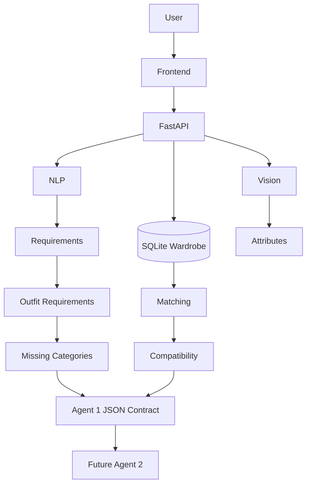

# FASHORA — Agent 1: Style & Wardrobe Intelligence

Complete, independently runnable web application for **Agent 1** of the FASHORA multi-agent fashion platform.

Agent 1 answers:

1. What does the user have? (wardrobe + vision attributes)
2. What does the user want? (NLP / structured extraction)
3. What outfit categories are needed?
4. What can already be used from the wardrobe?
5. What appears to be missing? (Agent 2 handoff)
6. What combinations are plausible? (compatibility heuristics)

Agent 1 **does not** search products, optimize budgets, or make purchase decisions.

---

## Architecture



---

## Quick start

### Backend (port 8001)

```bash
cd agents/agent1_wardrobe
python -m venv .venv

# Windows
.venv\Scripts\activate
# macOS/Linux
# source .venv/bin/activate

pip install -r requirements.txt
copy .env.example .env   # or: cp .env.example .env

# Run from repo root so `shared/` is importable, OR set PYTHONPATH:
cd ../..
set PYTHONPATH=%CD%          # Windows PowerShell: $env:PYTHONPATH = (Get-Location)
cd agents/agent1_wardrobe
uvicorn app.main:app --reload --port 8001
```

Swagger: http://localhost:8001/docs

Demo user (auto-seeded): `demo@fashora.ai` / `password123`

### Frontend (port 5173)

```bash
cd frontend
npm install
npm run dev
```

Open http://localhost:5173 — Vite proxies `/api` and `/uploads` to the backend.

---

## Environment variables

See `.env.example`:

| Variable | Purpose |
|---|---|
| `DATABASE_URL` | SQLite by default; swap for PostgreSQL later |
| `JWT_SECRET` | Auth signing key |
| `LLM_PROVIDER` | `gemini` (default, production), `mock` (testing only), `openai`, or `anthropic` |
| `LLM_API_KEY` | Only when using a live LLM |
| `VISION_MODEL_BACKEND` | `auto` / `local` / `clip` |
| `UPLOAD_DIR` | Local image storage |
| `MAX_UPLOAD_SIZE_MB` | Upload limit (default 10) |

---

## API surface

| Method | Path | Role |
|---|---|---|
| POST | `/api/auth/register` | Create account |
| POST | `/api/auth/login` | JWT login |
| GET | `/api/wardrobe` | List items |
| POST | `/api/wardrobe/upload` | Upload + analyze image |
| POST | `/api/wardrobe` | Confirm & save item |
| POST | `/api/analyze/request` | Full user analysis flow |
| POST | `/api/agent/analyze` | Inter-agent contract |
| GET | `/api/agent/schema` | JSON schemas |
| GET | `/api/agent/status` | Health & capabilities |
| POST | `/api/security/test-prompt` | Prompt-injection lab |

---

## AI pipeline (replaceable)

- **Vision (default):** Pillow + scikit-learn K-Means colour + texture heuristics; optional CLIP behind `clip_analyzer.py`
- **NLP (default):** Regex / synonym normalizer + Gemini structured extractor (deterministic NLP fallback; `mock` provider for tests)
- **Security:** Prompt injection guard on natural-language input
- **Reasoning:** Outfit requirement rules, missing-category set difference, multi-attribute compatibility scores with explanations

---

## Testing & evaluation

```bash
# From agents/agent1_wardrobe with PYTHONPATH=repo root
pytest -v

# From repo root
python evaluation/run_evaluation.py
```

Analysis results are stored in the `analysis_records` table (per user) so dashboard “last analysis” and `/api/analyze/{request_id}` survive restarts.

---

## Responsible AI

- No inference of race, body shape, attractiveness, or gender identity from images
- AI attributes are editable before save
- Compatibility scores are heuristics with explanations, not objective truth
- Uncertainty preserved (`budget=null`, `occasion=null` when unstated)

---

## Agent 2 integration

Consume `POST /api/agent/analyze` → `Agent1OutputContract`. Use `search_requirements` for retrieval queries. Agent 1 never says “buy this product.”
